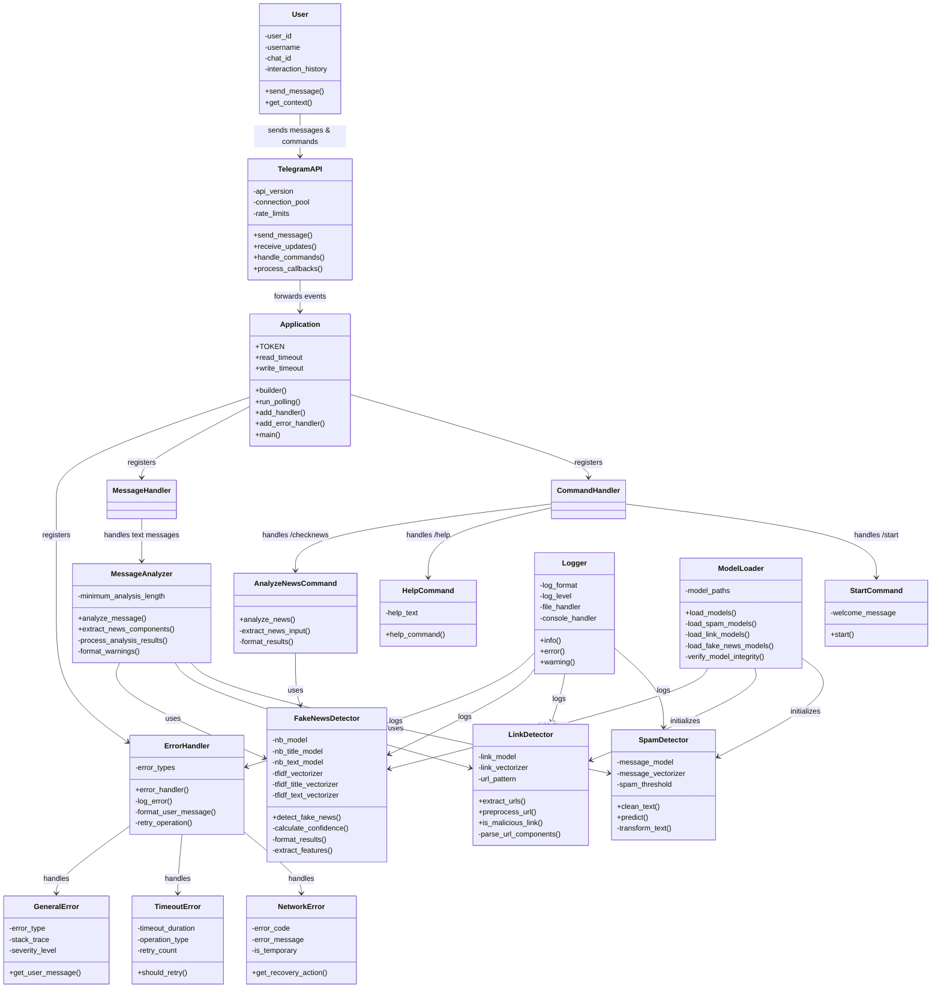

```mermaid
classDiagram
    User --> TelegramAPI : sends messages & commands
    TelegramAPI --> Application : forwards events
    
    Application --> CommandHandler : registers
    Application --> MessageHandler : registers
    Application --> ErrorHandler : registers
    
    class Application {
        +builder()
        +run_polling()
        +add_handler()
        +add_error_handler()
        +main()
        +TOKEN
        +read_timeout
        +write_timeout
    }
    
    CommandHandler --> StartCommand : handles /start
    CommandHandler --> HelpCommand : handles /help
    CommandHandler --> AnalyzeNewsCommand : handles /checknews
    MessageHandler --> MessageAnalyzer : handles text messages
    
    class StartCommand {
        +start()
        -welcome_message
    }
    
    class HelpCommand {
        +help_command()
        -help_text
    }
    
    class AnalyzeNewsCommand {
        +analyze_news()
        -extract_news_input()
        -format_results()
    }
    
    MessageAnalyzer --> SpamDetector : uses
    MessageAnalyzer --> LinkDetector : uses
    MessageAnalyzer --> FakeNewsDetector : uses
    AnalyzeNewsCommand --> FakeNewsDetector : uses
    
    class MessageAnalyzer {
        +analyze_message()
        +extract_news_components()
        -process_analysis_results()
        -format_warnings()
        -minimum_analysis_length
    }
    
    class SpamDetector {
        -message_model
        -message_vectorizer
        +clean_text()
        +predict()
        -transform_text()
        -spam_threshold
    }
    
    class LinkDetector {
        -link_model
        -link_vectorizer
        +extract_urls()
        +preprocess_url()
        +is_malicious_link()
        -url_pattern
        -parse_url_components()
    }
    
    class FakeNewsDetector {
        -nb_model
        -nb_title_model
        -nb_text_model
        -tfidf_vectorizer
        -tfidf_title_vectorizer
        -tfidf_text_vectorizer
        +detect_fake_news()
        -calculate_confidence()
        -format_results()
        -extract_features()
    }
    
    Logger --> SpamDetector : logs
    Logger --> LinkDetector : logs
    Logger --> FakeNewsDetector : logs
    Logger --> ErrorHandler : logs
    
    class Logger {
        +info()
        +error()
        +warning()
        -log_format
        -log_level
        -file_handler
        -console_handler
    }
    
    ModelLoader --> SpamDetector : initializes
    ModelLoader --> LinkDetector : initializes
    ModelLoader --> FakeNewsDetector : initializes
    
    class ModelLoader {
        +load_models()
        -load_spam_models()
        -load_link_models()
        -load_fake_news_models()
        -verify_model_integrity()
        -model_paths
    }
    
    ErrorHandler --> NetworkError : handles
    ErrorHandler --> TimeoutError : handles
    ErrorHandler --> GeneralError : handles
    
    class ErrorHandler {
        +error_handler()
        -log_error()
        -format_user_message()
        -retry_operation()
        -error_types
    }
    
    class NetworkError {
        -error_code
        -error_message
        -is_temporary
        +get_recovery_action()
    }
    
    class TimeoutError {
        -timeout_duration
        -operation_type
        -retry_count
        +should_retry()
    }
    
    class GeneralError {
        -error_type
        -stack_trace
        -severity_level
        +get_user_message()
    }
    
    class TelegramAPI {
        +send_message()
        +receive_updates()
        +handle_commands()
        +process_callbacks()
        -api_version
        -connection_pool
        -rate_limits
    }
    
    class User {
        -user_id
        -username
        -chat_id
        -interaction_history
        +send_message()
        +get_context()
    }

```
